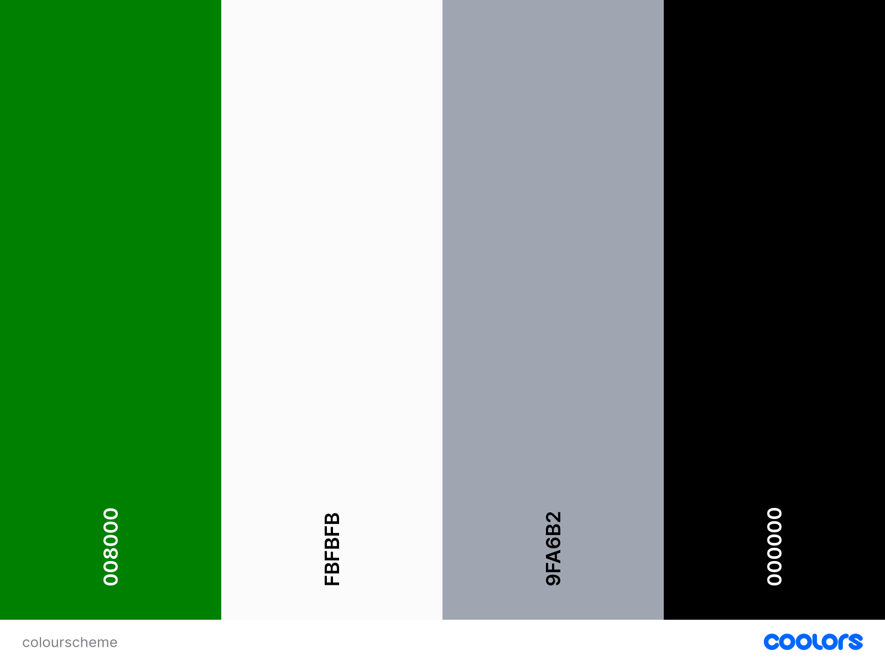

# Mentality Blog:

Mentality Blog is a platform designed for logging journal entries related to mental health. It provides users with a safe space to share their feelings, experiences, and resources with like-minded individuals, fostering a supportive community for collective benefit.

This blog offers a personal yet open space for those struggling with their mental health to find solace and support from others on a similar journey. Users can post their thoughts, track their mood for specific days, and share valuable resources such as articles, podcasts, videos, and books for the benefit of the entire community.

The live application can be viewed here : 

(https://mentalhealth-blog-59e7f6f2fb53.herokuapp.com/)

# Purpose and Target Audience:
 **Problem Statement:** Many individuals struggle to manage their mental health and track their emotional well-being, often resulting in increased stress and anxiety. The absence of a support structure can further intensify these mental health challenges.

**Purpose:** This mental health journal app offers a simple and intuitive way for individuals to log and share their thoughts and feelings, track their mental health, and identify patterns to improve emotional well-being. It also fosters connections with like-minded individuals who are on the same journey.

**Target Audience:** The primary target audience includes individuals seeking to improve their mental health, such as students, professionals, and anyone interested in mindfulness and self-care, as well as those looking for a stronger support structure.

# User Stories, Wireframes and Agile Methodology:

## User Stories:
* As a site user I can view a list of journal entries so that I can select which journal entry I want to read.
    Acceptance Criteria:
    * Given more than one journal entry entry in the database
    * When a user opens the main page a list of journal entries is seen
    * The user sees all journal entry headings and information to choose what to read
* As a site user I can register an account so that I can add journal entries.
    Acceptance Criteria:
    * Given a username, email and password a user can register an account
    * The user can log in
    * When the user is logged in the can add journal entries
* As a site user/admin I can view individual journal entries so that I can read the conversation.
    Acceptance Criteria:
    * Given one or more user journal entries the admin can view them
    * The site user can click on the journal entries to read the conversation
* As a site user I can modify or delete my journal entry so that I can amend my journal entry.
    Acceptance Criteria:
    * A logged in user can update their journal entry
    * A logged in user can delete their journal entry
* As a site admin I can create, read, update and delete posts so that I can manage the blog content.
    Acceptance Criteria:
    * A logged in user can create a journal entry
    * A logged in user can read a journal entry
    * A logged in user can update a journal entry
    * A logged in user can delete a journal entry

## Wireframe & Initial Design:
### Home Page

### (Logged in) View Journal Entries

### Create a Journal Entry

### Edit a Journal Entry

## Agile:
This project was developed using Agile principles, utilizing a Kanban board on GitHub. As my first experience implementing Agile as an individual developer, creating user stories and identifying acceptance criteria provided a clear roadmap for targeting the application's features and functionalities. This approach kept me focused and minimized distractions.

# Design Choices:

## Colour scheme:

The colours were selected with the intention of complementing the hero image and the idea was to ensure the overall experience was calming.

## Typography:
The following fonts were chosen for a clean, modern and calming look that is both easily readable and simplistic.

* Headings - Playfair Display
* Paragraphs - Arial, sans-serif

## Priority Features:

### Home Page:

#### Navbar & Hero Image:

The landing page introduces the website and features a call-to-action button encouraging new users to sign up. Once signed up and logged in, users can view journal entries and create their own for others to interact with via comments.

The navigation bar is user-friendly, offering quick access to key sections of the website. It includes links to Home, Journal Entries, Create Journal Entry, Register/Logout, and Sign In. A hero image with graphics enhances the page's aesthetic appeal, clearly conveying the website's purpose and inviting users to join the community.

#### Registration:

Registration enables users to access journal entries and relevant resources within the community. It allows them to create, edit, and delete their own journal entries, ensuring the community content remains current and engaging.

#### Sign-Up:

#### Sign-In:

#### Journal Entries:

#### Add a Journal Entry:

The form allows users to effortlessly create journal entries that will be displayed on the journal entries page for others to browse. Users also have the ability to edit and delete their own entries, giving them complete control over their contributions.

#### Footer:

The footer links redirect users to our social media pages, providing a way to stay connected with Mentality Blog on various platforms and receive updates about any changes over time.

# Future Features:

<!-- * Implement a review system so readers can share their thoughts about books that they have completed. This will give others a better idea of whether the book is a good fit for them. 
* Display if a book is available with a status (Available, Not Available).
* Allow users to reserve a book beforehand.
* A search engine where users can search for books by title, author and genre.
* Provide locations of nearest libraries.
* Provide a way for the users to engage and form a secure community.
* Include an about page to inform others of how The Book Booth Library works and how to use it. -->

Database Design:

Entity Relationship Diagrams (ERD) assist developers in establishing connections between databases and information. Crafting an ERD enhanced my comprehension of the relationships between tables. Utilizing dbdiagram.io facilitated the creation of the diagram, with arrows symbolizing the data field relationships.

## Data Models:

| User   |            |   |
|----------|:-------------:|------:|
| User_id |  IntegerField | FK |
| Username |  CharField   |   |
| Email | CharField |     |
| Password |  CharField |  |
| Created_at |  CharField   |   |
| Role | CharField |     |

| JournalEntry   |            |   |
|----------|:-------------:|------:|
| Title |  CharField |  |
| Slug |  SlugField |  |
| User |  ForeignKey | FK |
| Published_on |  DateTimeField |  |
| Entry_text |  TextField |  |
| Mood |  IntegerField |  |
| Resource |  ForeignKey | FK |
| Resourcetitle |  CharField |  |
| Resourceurl |  URLField |  |

| Resource   |            |   |
|----------|:-------------:|------:|
| Title |  CharField |   |
| Resource_type |  CharField | PK |

## User Flow Chart:

The flowchart was instrumental in guiding crucial decisions throughout the app's development process. It enabled me to pinpoint key considerations for users and administrators alike, while also establishing robust authentication protocols. Furthermore, it assisted in prioritizing vital features such as adding, editing, and deleting journal entries.

# Validation
## HTML

<!-- | Page | W3C URL | Screenshot | Notes |
| --- | --- | --- | --- |
| Home | [W3C](https://validator.w3.org/nu/?doc=https%3A%2F%2Fthebookbooth1-559d9131718c.herokuapp.com%2F) |  | Pass: button is a descendant of a tag |
| Books | [W3C](https://validator.w3.org/nu/?doc=https%3A%2F%2Fthebookbooth1-559d9131718c.herokuapp.com%2Fbooks%2Fbooks%2F) |  | Pass: No Errors |
| Add a Book | [W3C](https://validator.w3.org/nu/?doc=https%3A%2F%2Fthebookbooth1-559d9131718c.herokuapp.com%2Fbooks%2Fadd_book%2F) |  | Pass: No Errors |
| Sign In| [W3C](https://validator.w3.org/nu/?doc=https%3A%2F%2Fthebookbooth1-559d9131718c.herokuapp.com%2Faccounts%2Flogin%2F) |  | Pass: No Errors |
| Register| [W3C](https://validator.w3.org/nu/?doc=https%3A%2F%2Fthebookbooth1-559d9131718c.herokuapp.com%2Faccounts%2Fsignup%2F) |  | unclosed elements main and div | -->

 ## CSS

 I have used the recommended [CSS Jigsaw Validator](https://jigsaw.w3.org/css-validator) to validate my CSS file.
 
<!-- | File | Jigsaw URL | Screenshot | Notes |
| --- | --- | --- | --- |
| style.css | [Jigsaw](https://jigsaw.w3.org/css-validator/validator?uri=https%3A%2F%2Fthebookbooth1-559d9131718c.herokuapp.com%2F&profile=css3svg&usermedium=all&warning=1&vextwarning=&lang=enhttps://jigsaw.w3.org/css-validator/validator) |  | Pass: No Errors | -->

## Python

I have used the recommended [PEP8 CI Python Linter](https://pep8ci.herokuapp.com) to validate all of my Python files.

<!-- | File | CI URL | Screenshot | Notes |
| --- | --- | --- | --- |
| forms.py | [PEP8 CI](https://pep8ci.herokuapp.com/https://raw.githubusercontent.com/hiboibrahim/thebookbooth1/main/run.py) | ![screenshot]
 | Pass: No Errors |
| settings.py | [PEP8 CI](https://pep8ci.herokuapp.com/https://raw.githubusercontent.com/hiboibrahim/thebookbooth1/main/boutique-ado/settings.py) | ![screenshot]
 | Pass: No Errors |
| Book views.py | [PEP8 CI](https://pep8ci.herokuapp.com/https://raw.githubusercontent.com/hiboibrahim/thebookbooth1/main/blog/views.py) | ![screenshot]
 | Pass: No Errors |
| Book urls.py | [PEP8 CI](https://pep8ci.herokuapp.com/https://raw.githubusercontent.com/hiboibrahim/thebookbooth1/main/checkout/urls.py) | ![screenshot]
 | Pass: No Errors |
|  models.py | [PEP8 CI](https://pep8ci.herokuapp.com/https://raw.githubusercontent.com/hiboibrahim/thebookbooth1/main/profiles/models.py) | ![screenshot]
 | Pass: No Errors | -->

# Responsiveness:
Development tools were used to test responsiveness on varying sized devices including laptop, mobile and tablet size.

Full testing was performed on the following devices:

Laptops:

<!-- * Macbook Air 2018 13.3-inch screen
* Lenovo Thinkpad 14" screen -->

 Mobile Devices:
<!-- * Google Pixel 4a -->

 * Browser Compatibility:
 
 I have tested the site using the following browsers:

* Google Chrome

<!--  -->

* Microsoft Edge

<!--  -->

I can confirm that the site is responsive and looks as expected good on different screen sizes.

Mobile devices:

<!-- 

 -->

Tablet Devices:

<!-- 

 -->

# Testing:

## Lighthouse Audit:

I've tested my deployed project using the Lighthouse Audit tool to check for any major issues.

* On a laptop:

Home

<!--  -->

Books 

<!--  -->

Add a book 
<!--  -->

On a mobile device:

Home 
<!--  -->

Books
<!--  -->

Add a book 
<!--  -->

## Links

<!-- | Link | Expected Outcome | Grade |
| ------- | ---------------- | ----- |
| Logo | Navigates to the home page when clicked | Fail |
| Home | Navigates to the home page when clicked | Pass |
| Books | Navigates to a book list  page when clicked | Pass |
| Add a Book | Navigates to a form to add a book when clicked | Pass |
| Register | Navigates to a registration form when clicked | Pass |
| Log in | Navigates to a screen where users can log in when clicked | Pass |
| Logout | Navigates to a page confirming for the user to log out | Pass | -->

## Testing 

<!-- | Feature | Expected Outcome | Grade | Screenshots |
| ------- | ---------------- | ----- | --------- |
| Modal | A message will appear informing the user of a successful action | Pass | 
| User logged in | Text displays the user logged in with their username | Pass | 
| View books | Users can see available books which have been added | Pass | 
| Add a book | Add a book to the book collection that will be available to borrow | Pass | 
| Admin has access to crud functionality of all additions | Admin can edit or delete any book addition | Pass | 
| Edit a book | A user can edit the details on the book that they have addded. It will update their addition on the books page | Pass | 
| Delete a book | A user who added a book OR an admin can delete a book. It will then be deleted from the DB | Pass | 
| Registration | New users can access a registration form from the "Register" link | Pass | 
| Log in | Users can log in using a form after clicking "Log in" | Pass | 
| Log out | Users get logged out after clicking "Log out" | Pass | 
| Grid display | A CSS grid will display the books in a clear, responsive format | Pass | N/A
| Functional buttons | Edit, delete, create buttons will be functional throughout the site | Pass | 
| Footer | A footer displays social information | Pass | 
| Social links work | The social links will navigate to a new page when they're clicked. They will open in a new tab | Pass |  -->

# Tools and Technologies Used:
The technologies implemented in this application included HTML5, CSS, Bootstrap, Python and Django.

* Python used as the back-end programming language.
* Git used for version control. (git add, git commit, git push)
* GitHub used for secure online code storage.
* GitHub Pages used for hosting the deployed front-end site.
* Gitpod used as a cloud-based IDE for development.
* Bootstrap used as the front-end CSS framework for modern responsiveness and pre-built components.
* CI Database Generator used as the Postgres database.
* Heroku used for hosting the deployed back-end site.
* Cloudinary used for online static file storage.
* Canva Utilized for collaborative design and prototyping(wireframes).
* Google, Stack Overflow and Phind utilized for general research or solving a bug, information gathering, and various online tools.

# Languages Used:
* HTML5
* CSS
* Python

# Deployment :

I used the steps used when deploying our django blog to deploy this application. The instructions for this mainly came from the follow along videos and text-steps provided on the code institute LMS.

# Bugs

* Slug Field not operational yet due to the Comments model not being created as yet. This would be a future feature to implement and the slug field would be used to link the journal entry to the comment and also allow for editing and deleting comments. Currently, this does not affect the user CRUD functionality.

* Horizontal scroll tab appears on the Journal Entries page when pagination occurs past 6 journal entries. This does not affect the user experience however it is something that would be resolved in the future.

Most bugs that occured during the creation of this application have been resolved. There is a section of the application which allows you to reset your password that needs to be implemented, however they were not within the scope of this particular project and will be addressed in the near future along with the following future features:

* 

# Credit: 

* Although I used the django blog resources provided on the LMS, I also received alot of additional clarification by reaching to fellow students in the cohort and drawing inspiration from the walkthrough project on the LMS.

* Tutor Support, Google, Stack Overflow, Phind and ChatGPT was used to solve any smaller bugs and further clarification on errors I was receiving in the terminal.

* Thank you to all the other individuals in our cohort for their continuous support throughout the course.

* Font Awesome was used for icons and the fonts used were derived from Google Fonts.

* Wireframes were created with Balsamiq and Canva.

* Flowcharts were created using LucidChart.

* The text and descriptions were generated by ChatGPT.