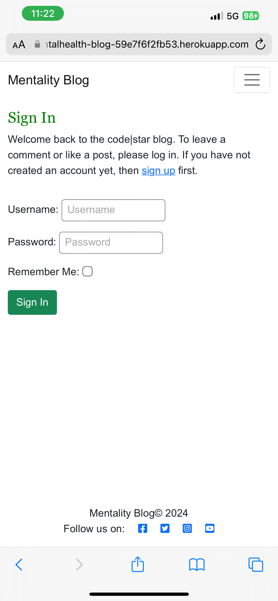

# Mentality Blog

Mentality Blog is a platform designed for logging journal entries related to mental health. It provides users with a safe space to share their feelings, experiences, and resources with like-minded individuals, fostering a supportive community for collective benefit.

This blog offers a personal yet open space for those struggling with their mental health to find solace and support from others on a similar journey. Users can post their thoughts, track their mood for specific days, and share valuable resources such as articles, podcasts, videos, and books for the benefit of the entire community.

The live application can be viewed here : 

(https://mentalhealth-blog-59e7f6f2fb53.herokuapp.com/)

# Purpose and Target Audience:
 **Problem Statement:** Many individuals struggle to manage their mental health and track their emotional well-being, often resulting in increased stress and anxiety. The absence of a support structure can further intensify these mental health challenges.

**Purpose:** This mental health journal app offers a simple and intuitive way for individuals to log and share their thoughts and feelings, track their mental health, and identify patterns to improve emotional well-being. It also fosters connections with like-minded individuals who are on the same journey.

**Target Audience:** The primary target audience includes individuals seeking to improve their mental health, such as students, professionals, and anyone interested in mindfulness and self-care, as well as those looking for a stronger support structure.

# User Stories, Wireframes and Agile Methodology:

## User Stories:
* As a site user I can view a list of journal entries so that I can select which journal entry I want to read.
    * Acceptance Criteria:
        * Given more than one journal entry in the database
        * When a user opens the journal entries page a list of journal entries is seen
        * The user sees all journal entry headings and information to choose what to read
* As a site user I can register an account so that I can add journal entries.
    * Acceptance Criteria:
        * Given a username, email and password a user can register an account
        * The user can log in
        * When the user is logged in, they have CRUD functionality for journal entries
* As a site user/admin I can view individual journal entries so that I can read the conversation.
    * Acceptance Criteria:
        * Given one or more user journal entries the admin can view them
        * The site user can click on the journal entries page so that they can view their journal entry
* As a site user I can modify or delete my journal entry so that I can amend my journal entry.
    * Acceptance Criteria:
        * A logged in user can update their journal entry
        * A logged in user can delete their journal entry
* As a site user / admin I can create, read, update and delete posts so that I can manage the blog content.
    * Acceptance Criteria:
        * A logged in user and admin can create a journal entry
        * A logged in user and admin can read a journal entry
        * A logged in user and admin can update a journal entry
        * A logged in user and admin can delete a journal entry

## Wireframe, Agile & Initial Design:
### Home Page

### (Logged in) View Journal Entries

### Create a Journal Entry

### Edit a Journal Entry

## Agile:
This project was developed using Agile principles, utilizing a Kanban board on GitHub. As my first experience implementing Agile as an individual developer, creating user stories and identifying acceptance criteria provided a clear roadmap for targeting the application's features and functionalities. This approach kept me focused and minimized distractions.

# Design Choices:

## Colour Scheme:

The colours were selected with the intention of complementing the hero image and the idea was to ensure the overall experience was calming.

## Typography:
The following fonts were chosen for a clean, modern and calming look that is both easily readable and simplistic.

* Headings - Playfair Display
* Paragraphs - Arial, sans-serif

## Priority Features:

### Home Page:

#### Navbar & Hero Image:

The landing page introduces the website and features a call-to-action button encouraging new users to sign up. Once signed up and logged in, users can view journal entries and create their own for others to interact with via comments.

The navigation bar is user-friendly, offering quick access to key sections of the website. It includes links to Home, Journal Entries, Create Journal Entry, Register/Logout, and Sign In. A hero image with graphics enhances the page's aesthetic appeal, clearly conveying the website's purpose and inviting users to join the community.

#### Registration:

Registration enables users to access journal entries and relevant resources within the community. It allows them to create, edit, and delete their own journal entries, ensuring the community content remains current and engaging.

#### Sign-Up:

#### Sign-In:

#### Journal Entries:

#### Add a Journal Entry:

The form allows users to effortlessly create journal entries that will be displayed on the journal entries page for others to browse. Users also have the ability to edit and delete their own entries, giving them complete control over their contributions.

#### Footer:

The footer links redirect users to our social media pages, providing a way to stay connected with Mentality Blog on various platforms and receive updates about any changes over time.

# Database Schema and Design:

Database Design:

Entity Relationship Diagrams (ERD) assist developers in establishing connections between databases and information. Crafting an ERD enhanced my comprehension of the relationships between tables. Utilizing dbdiagram.io facilitated the creation of the diagram, with arrows symbolizing the data field relationships.

## Data Models:

| User   |            |   |
|----------|:-------------:|------:|
| User_id |  IntegerField | PK |
| Username |  CharField   |   |
| Email | CharField |     |
| Password |  CharField |  |
| Created_at |  CharField   |   |
| Role | CharField |     |

| JournalEntry   |            |   |
|----------|:-------------:|------:|
| Title |  CharField |  |
| Slug |  SlugField |  |
| User |  ForeignKey | FK |
| Published_on |  DateTimeField |  |
| Entry_text |  TextField |  |
| Mood |  IntegerField |  |
| Resource |  ForeignKey | FK |
| Resourcetitle |  CharField |  |
| Resourceurl |  URLField |  |

| Resource   |            |   |
|----------|:-------------:|------:|
| Title |  CharField |   |
| Resource_type |  CharField | PK |

## User Flow Chart:

The flowchart was instrumental in guiding crucial decisions throughout the app's development process. It enabled me to pinpoint key considerations for users and administrators alike, while also establishing robust authentication protocols. Furthermore, it assisted in prioritizing vital features such as adding, editing, and deleting journal entries.

# Validation:
## HTML:

| Page | W3C URL | Screenshot | Notes |
| --- | --- | --- | --- |
| Home | [W3C] |  | Pass: No Errors |
| Journal Entries | [W3C] |  | Pass: No Errors |
| Add an Entry | [W3C] |  | Pass: No Errors |
| Sign In| [W3C] |  | Pass: No Errors |
| Register| [W3C] |  | Fail: Errors with end tags, unclosed element and stray end tags all originate from within AllAuth |

 ## CSS:

 I have used the recommended [CSS Jigsaw Validator](https://jigsaw.w3.org/css-validator) to validate my CSS file.
 
| File | Jigsaw URL | Screenshot | Notes |
| --- | --- | --- | --- |
| style.css | [Jigsaw] |  | Pass: No Errors |

## Python:

I have used the recommended [PEP8 CI Python Linter](https://pep8ci.herokuapp.com) to validate all of my Python files.

| File | CI URL | Screenshot | Notes |
| --- | --- | --- | --- |
| admin.py | [PEP8 CI] | ![screenshot]| Pass: No Errors |
| apps.py | [PEP8 CI] | ![screenshot]| Pass: No Errors |
| forms.py | [PEP8 CI] | ![screenshot]| Pass: No Errors |
| models.py | [PEP8 CI] | ![screenshot]| Pass: No Errors |
| Blog urls.py | [PEP8 CI] | ![screenshot]| Pass: No Errors |
|  views.py | [PEP8 CI] | ![screenshot]| Pass: No Errors |
 |  settings.py | [PEP8 CI] | ![screenshot]| Pass: No Errors |
 | MentalHealth urls.py | [PEP8 CI] | ![screenshot]| Pass: No Errors |

## JavaScript:

I have used the recommended [JSHint JavaScript Validator](https://jshint.com/) to validate my JavaScript files.

| File | CI URL | Screenshot | Notes |
| --- | --- | --- | --- |
| delete.js | [JSHint] | ![screenshot] | Pass: No Errors |

# Responsiveness:
Development tools were used to test responsiveness on varying sized devices including laptop, mobile and tablet size.

Full testing was performed on the following devices:

Laptops:

* Macbook Pro 2013 13.3-inch screen
* Dell Latitude 7420 14" screen

 Mobile Devices:
* Samsung Galaxy A53
* Apple iPhone 12 Pro Max

Browser Compatibility:

I have tested the site using the following browsers:

* Google Chrome

* Microsoft Edge

I can confirm that the site is responsive and displays as intended across various screen sizes.

Mobile devices:

* Samsung - Panda Browser

* iPhone - Safari Browser

Tablet Devices:

* Apple iPad

# Testing:

## Lighthouse Audit:

I've tested my deployed project using the Lighthouse Audit tool to check for any major issues.

* On a laptop:

Home

Journal Entries 

Add an Entry

On a mobile device:

Home

Journal Entries 

Add an Entry

## Links:

| Link | Expected Outcome | Grade |
| ------- | ---------------- | ----- |
| Logo | Navigates to the home page when clicked | Pass |
| Home | Navigates to the home page when clicked | Pass |
| Journal Entries | Navigates to Journal Entries page when logged in and clicked | Pass |
| Add an Entry | Navigates to a form to add a Journal Entry when logged in and clicked | Pass |
| Mental Health Articles | Opens a new window to the Mental Health Foundation website when clicked | Pass |
| Meditation Videos | Opens a new window to Pexels Free Meditation Videos website when clicked | Pass |
| Emergency Contacts | Opens a new window to NHS Urgent Help for Mental Health website when clicked | Pass |
| Social Media Links | Opens a new window to the respective social media website when clicked | Pass |
| Sign-Up | Navigates to a sign-up form when clicked | Pass |
| Sign-In | Navigates to a screen where users can sign-in when clicked | Pass |
| Logout | Navigates to a page confirming for the user to log out | Pass |

## Feature Testing:

| Feature | Expected Outcome | Grade | Screenshots |
| ------- | ---------------- | ----- | --------- |
| User logged in | Text message displays the user logged in with their username | Pass | 
| View journal entries | Users can see journal entries which have been added | Pass | 
| Add a journal entry | Add a journal entry to the journal entries page | Pass | 
| Admin has access to CRUD functionality of all additions | Admin can edit or delete any journal entry | Pass | 
| Edit a journal entry | A user can only edit the details on the journal entry that they have addded. It will update their addition on the journal entries page | Pass | 
| Delete a journal entry | A user who added a journal entry can delete a journal entry. It will then be deleted from the database | Pass | 
| Registration | New users can access a sign-up form from the "Sign-Up" link | Pass | 
| Sign-In | Users can sign-in using a form after clicking "Sign-In" | Pass | 
| Log out | Users get logged out after clicking "Sign Out" | Pass | 
| List view | A Django list view function will display the journal entries in a clear, responsive format | Pass | 
| Functional buttons | Edit, delete, save and cancel buttons will be functional throughout the site | Pass | 
| Footer | A footer displays social information | Pass | 
| Social links work | The social links will navigate to a new page when they're clicked. They will open in a new tab | Pass | 

## User Story Testing:

| User Story | Acceptance Criteria | Outcome | Screenshots |
| ------- | ---------------- | ----- | --------- |
| As a site user I can view a list of journal entries so that I can select which journal entry I want to read. | * Given more than one journal entry in the database. * When a user opens the journal entries page a list of journal entries is seen. * The user sees all journal entry headings and information to choose what to read | Met | 
| As a site user I can register an account so that I can add journal entries. | * Given a username, email and password a user can register an account. * The user can log in. * When the user is logged in, they have CRUD functionality for journal entries | Met | 
| As a site user/admin I can view individual journal entries so that I can read the conversation. | * Given one or more user journal entries the admin can view them. * The site user can click on the journal entries page so that they can view their journal entry | Met | 
| As a site user I can modify or delete my journal entry so that I can amend my journal entry. | * A logged in user can update their journal entry. * A logged in user can delete their journal entry. | Met | 
| As a site user/admin I can create, read, update and delete posts so that I can manage the blog content. | * A logged in user and admin can create, read, update, delete a journal entry. | Met | 

# Tools and Technologies Used:
The technologies implemented in this application included HTML5, CSS, JavaScript, Bootstrap, Python and Django.

* Python used as the back-end programming language.
* Git used for version control. (git add, git commit, git push)
* GitHub used for secure online code storage.
* GitHub Pages used for hosting the deployed front-end site.
* Gitpod used as a cloud-based IDE for development.
* Django built-in HTML and CSS template for blog website used for basic layout.
* Bootstrap used as the front-end CSS framework for modern responsiveness and pre-built components.
* CI Database Generator used as the Postgres database.
* Heroku used for hosting the deployed back-end site.
* Cloudinary used for online static file storage.
* Canva and Balsamiq Utilized for collaborative design and prototyping(wireframes).
* Google, Stack Overflow and Phind utilized for general research or solving a bug, information gathering, and various online tools.

# Languages Used:
* HTML5
* CSS
* JavaScript
* Python

# Deployment:

## GitHub Repository

The Mentality Blog website was developed using GitPod and deployed to a GitHub repository named "mh-blog". The following Git commands were utilised during the development process:

    1. 'git add .' - Added all changes to the staging area.
    2. 'git commit -m' - Committed the changes and messages to the local repository.
    3. 'git push' - Pushed the committed chages to the remote "mh-blog" respository on GitHub.

## Heroku Deployment

The website was successfully deployed using Heroku. The deployment process involved the following steps:

    1. Log in to Heroku and click "New" to create a new app.
    2. Assign a name to the app, choose your region, and click "Create App".
    3. Under the "Settings" tab, navigate to "Config Vars" and add the following environment variables:
        - SECRET_KEY: (Your secret key)
        - DATABASE_URL: (Your database URL)
        - CLOUDINARY_URL: (Your cloudinary storage URL)
    4. Set the deployment method to GitHub and connect the appropriate repository.
    5. In the "Manual Deploy" section, select the main branch and click "Deploy Branch".

Once development is complete, the app will be deployed to Heroku and this process may take some time.

# Bugs:

* The slug field is currently not operational because the Comments model has not been created yet. This feature will be implemented in the future, enabling the slug field to link journal entries to comments and allow for editing and deleting comments. For now, this limitation does not impact the user’s ability to create, read, update, and delete journal entries.

* A horizontal scroll tab appears on the Journal Entries page when pagination exceeds six entries. While this does not impact the user experience, it is an issue that will be addressed in the future.

* Upon signing in, the success message does not appear on the home page but does show up when the user navigates to the Journal Entries page. Additionally, some unexpected bullet points appear, which I have not yet addressed. These issues will be resolved in a future update.

Most bugs encountered during the creation of this application have been resolved. However, a section allowing users to reset their passwords still needs to be implemented. This feature was not within the scope of this particular project but will be addressed soon.

# Future Features:

As well as fixing the bugs above, the following future enhancements would also be implemented:

* A comments model will allow users to comment on specific journal entries, creating conversation threads between users.

* Admins will have the ability to approve or reject comments before they appear on the website.

* Users will be able to track their moods over specific time periods (e.g., 1 week, 2 weeks, 1 month, 3 months) and view these trends on a graph. This feature will highlight periods of happy, neutral, and sad moods, allowing users to navigate to those periods in their journal entries to help identify triggers.

* Users will have the ability to share their mood tracking graphs with others to aid in identifying triggers, with mental health professionals available to provide responses on the website.

* The excerpts on the Home page, which currently have a "Continue reading" link directing users to the Journal Entries page, will be updated automatically. One will display the most recent update message from The Mentality Blog Team, and the other will show the latest journal entry from a user.

* A filter will be added to the Journal Entries page, enabling users to view entries based on their preferences, such as filtering by happy mood to see only happy journal entries.

# Credit: 

* Although I used the django blog resources provided on the LMS, I also received alot of additional clarification by reaching to fellow students in the cohort and drawing inspiration from the walkthrough project on the LMS.

* The built-in Django blog HTML template was utilized for the foundational HTML and CSS design, providing a polished and professional look tailored to the needs of a blog website for the target audience.

* Tutor Support, Google, Stack Overflow, Phind and ChatGPT was used to solve any smaller bugs and further clarification on errors I was receiving in the terminal.

* A special thank you to my mentor, Iris, The Code Institute including Tutor and Student Support and Charlie, Rebecca and Chibueze from our cohort for all their help and support in my achieving the completion of this project.

* Thank you to all the other individuals in our cohort for their continuous support throughout the course.

* Font Awesome was used for icons and the fonts used were derived from Google Fonts.

* Wireframes were created with Balsamiq and Canva.

* Flowcharts were created using LucidChart.

* The text and descriptions were generated by ChatGPT.